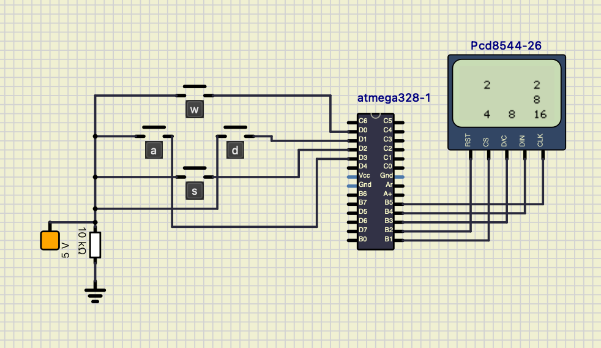

# 2048 - Jogo para Nokia 5110 Display

Este é o repositório do jogo 2048, desenvolvido em linguagem C para rodar em um Nokia 5110 Display. O jogo é uma versão adaptada do popular jogo de quebra-cabeça "2048", projetado especificamente para funcionar com o display mencionado.

Este projeto foi desenvolvido como parte de um trabalho realizado no curso de Ciência da Computação da PUCRS.

## Requisitos

Antes de executar o jogo, certifique-se de que você tenha os seguintes requisitos:

- [SimullIDe 0.4.15] instalado em seu sistema.
- O arquivo `final.semu` aberto no SimullIDe.
- Um processador conectado ao display 5110.
- O arquivo `code.hex` carregado no processador.

## Executando o Jogo

Siga as etapas abaixo para executar o jogo:

1. Certifique-se de que todos os requisitos mencionados acima sejam atendidos.
2. Clone este repositório em sua máquina local:
3. Acesse o diretório do projeto: cd 2048-Nokia-5110-Display
4. Abra o SimullIDe 0.4.15 em seu sistema.
5. Abra o arquivo `final.semu` no SimullIDe.
6. Conecte o processador ao display 5110.
7. Carregue o arquivo `code.hex` no processador.
8. Execute o SimullIDe para iniciar a simulação.
9. O jogo 2048 será exibido no Nokia 5110 Display.
10. Use as teclas ou controles correspondentes para jogar o jogo.
